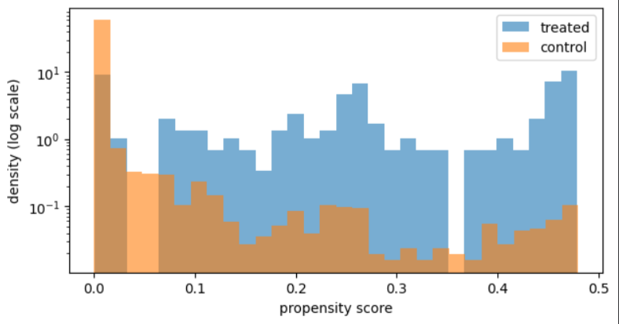
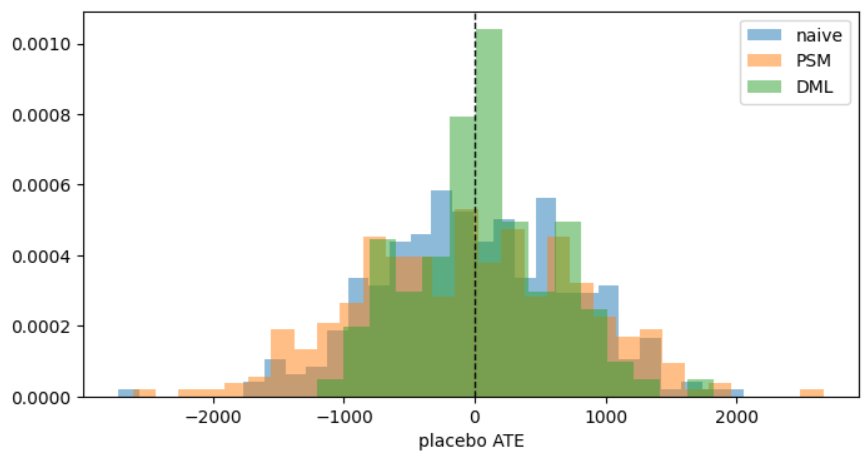

# Causal Inference Benchmark: Lalonde NSW

Оценка причинного эффекта тренинговой программы (National Supported Work
Demonstration) шестью подходами - от наивного сравнения до DML, с
сопоставлением каждой оценки против истинного эффекта, известного из RCT.

## Идея

Lalonde NSW - редкий датасет, где для одной и той же программы доступны
сразу и экспериментальные данные (известный правильный ответ), и
наблюдательный аналог того же вопроса (типичная ситуация в продуктовой
аналитике - нет честного A/B). Это позволяет не просто применить метод, а
проверить, насколько он в принципе восстанавливает истину.

## Данные

[`causaldata`](https://pypi.org/project/causaldata/) (Cunningham, "Causal
Inference: The Mixtape"):
- `nsw_mixtape` - экспериментальная выборка (185 treated / 260 control)
- `cps_mixtape` - наблюдательный control-пул (CPS, 15,992 набл., не связан
  с программой)

## Структура

| Файл                           | Содержание                                                              |
| ------------------------------ | ----------------------------------------------------------------------- |
| `01_baseline_rct.ipynb`        | Эталонный ATE на RCT-данных, проверка баланса                           |
| `02_observational_naive.ipynb` | Наивная оценка на NSW+CPS, величина смещения                            |
| `03_matching.ipynb`            | Matching (Mahalanobis), PSM, PSW                                        |
| `04_dml.ipynb`                 | Double Machine Learning (AIPW, cross-fitting)                           |
| `05_validation.ipynb`          | Placebo-тест, чувствительность к набору confounders                     |
| `ci_utils.py`                  | Общие функции (SMD, diff-in-means, paired/weighted ATT, I/O артефактов) |
| `benchmark.json`               | Эталонный ATE - генерируется в 01, читается в 02-05                     |
| `results.csv`                  | Сквозная таблица всех оценок - пополняется в 02-04                      |

Ноутбуки запускаются по порядку (01->05): каждый следующий читает артефакты
предыдущих (`benchmark.json`, `results.csv`) вместо хардкода чужих чисел.

## Результат

| Метод                       | ATE/ATT | 95% CI           | bias vs эталон |
| --------------------------- | ------- | ---------------- | -------------- |
| RCT (эталон)                | 1,794   | [551, 3,038]     | 0              |
| Наивное сравнение (NSW+CPS) | -8,498  | [-9,893, -7,102] | -10,292        |
| Matching (Mahalanobis)      | 2,089   | [665, 3,512]     | +294           |
| PSM                         | 1,663   | [205, 3,121]     | -131           |
| PSW (IPW)                   | 1,118   | [-115, 2,357]    | -677           |
| DML (AIPW)                  | 917     | [-360, 2,193]    | -878           |

**PSM ближе всего к эталону.** Matching (Mahalanobis) даёт лучший баланс
ковариат (SMD ≈ 0 по всем восьми - прямое совпадение по каждому измерению),
но это не гарантирует более точную точечную оценку на конкретной выборке.
DML - самое большое смещение, при сопоставимом с другими методами SE:
проблема не в разбросе оценки, а в том, что гибкость ML-моделей не успевает
окупиться при 185 treated и сильном дисбалансе групп.

Диапазоны propensity score у групп пересекаются полностью - overlap не
ограничивает matching/PSM/PSW; проблема результата не в отсутствии похожих
control-наблюдений, а в том, что таких наблюдений мало относительно всего
CPS-пула.

## Валидация

**Placebo-тест** (Часть 5): внутри CPS-пула (истинный эффект программы, там
заведомо 0) случайно назначаются "фейковые" treated, и вся процедура
прогоняется заново - 300 раз для naive/PSM, 100 для DML.

Naive и PSM несмещены под H0 (среднее ≈0), reject rate близок к номинальным  
5%. DML при R=100 повторов тоже показывает reject rate точно 0.050 -  
совпадает с номинальным α=0.05, size distortion не обнаружен; средний  
плацебо-эффект (74) - в пределах шума вокруг нуля. Matching (Mahalanobis)  
и PSW placebo-тестом пока не покрыты - известное ограничение текущей  
версии.

**Sensitivity (leave-one-out):** результат PSM/DML почти целиком держится
на одной ковариате - `re74`/`re75` (доход за 1-2 года до эксперимента).
Без неё PSM падает с 1,663 до ~130-160, DML - с ~860 до ~200. Остальные
ковариаты влияют слабо.
